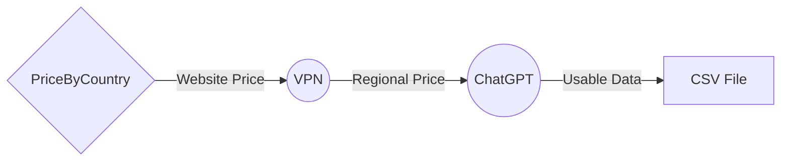
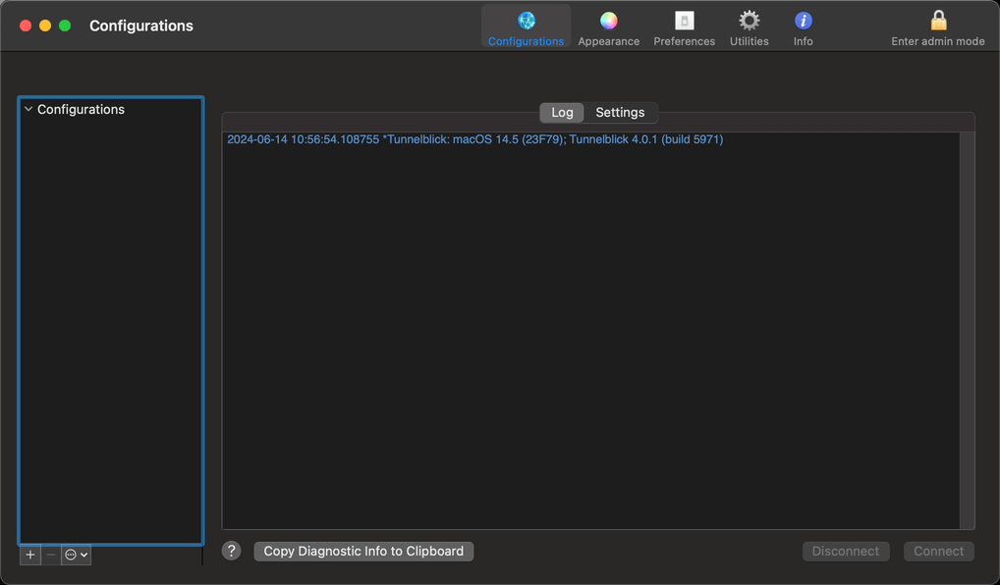
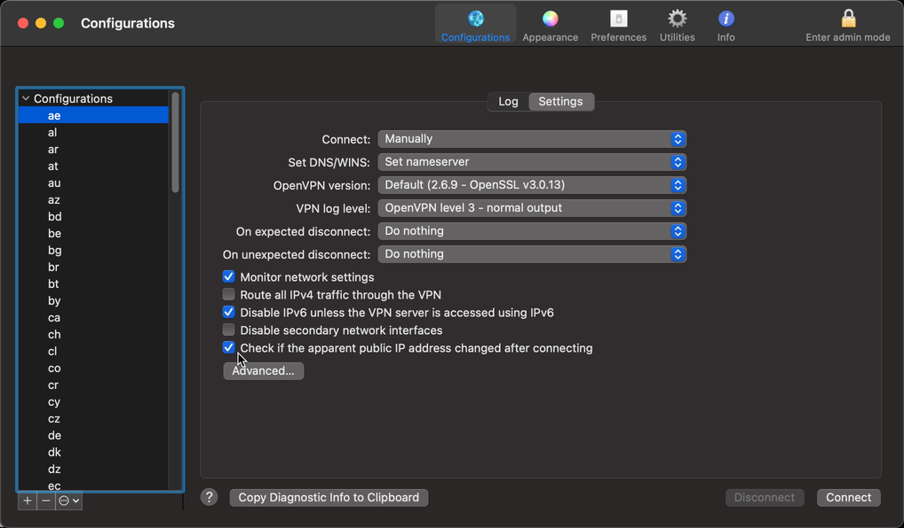
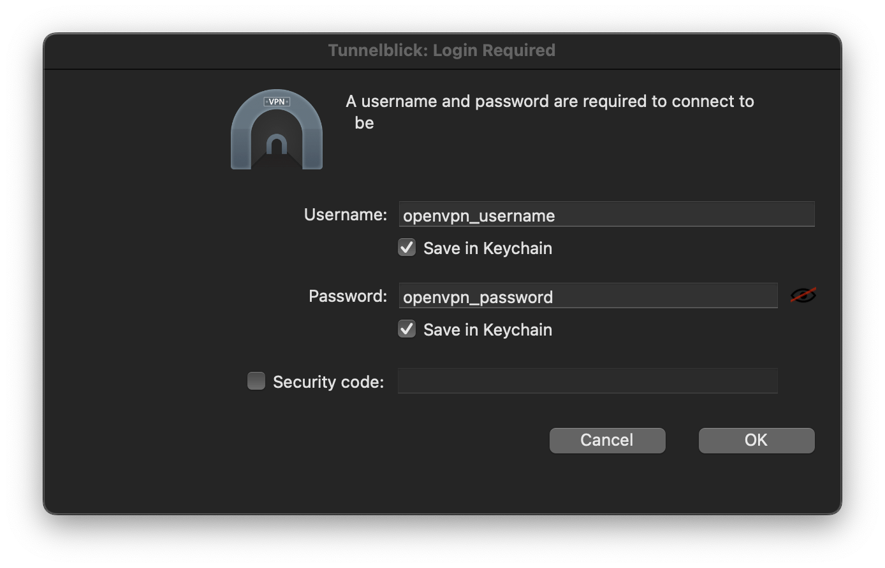
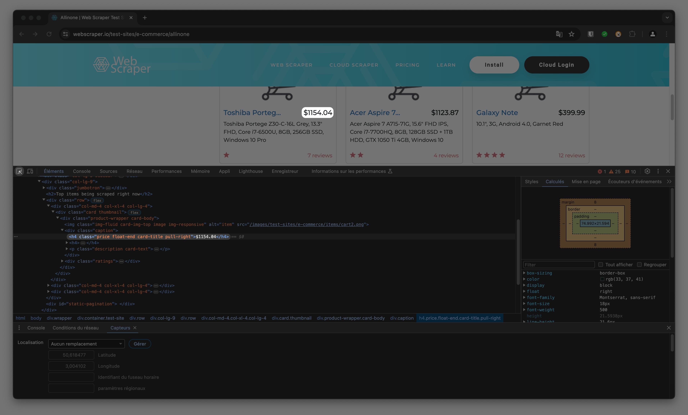

<h1 align="center" id="pricebycountry">PriceByCountry</h1>
<p align="center"></p>
<h3 align="center" id="get-the-price-for-any-website-in-every-country-">Get the price for any website in every country.</h3>
<p align="center"><strong>PriceByCountry is a Python program designed to fetch regional prices from a website in every country, simulating accesses through various VPNs. It supports entire process from fetching to conversion to usable data in a CSV file.</strong></p>
<h3 align="center"><a target="_blank" href="https://octavegraf.github.io/pricebycountry/"><strong>Website</strong></a> | <a target="_blank" href="https://github.com/octavegraf/pricebycountry"><strong>Github</strong></a></h3>



<h2 id="table-of-contents">Table of contents</h2>
<a href="#pricebycountry">PriceByCountry</a></li>
<ul>
    <li><a href="#installation">Installation</a></li>
    <li><a href="#usage">Usage</a>
        <ul>
            <li><a href="#downloading-openvpn-files-required">Downloading OpenVPN files</a></li>
            <li><a href="#configuration-file-required">Configuration file</a></li>
            <li><a href="#fetch-prices">Fetch prices</a></li>
        </ul>
    </li>
    <li><a href="#dependencies">Dependencies</a></li>
</ul>
<p align="center"></p>
<p align="center"><strong>This program was tested only with ProtonVPN. It will probably work on other VPNs supporting OpenVPN.</strong></p>

## Installation

<details>
<summary>MacOS</summary>

**Requirements : Python 3.12, Homebrew, Google Chrome**

1. Install the [last version of Tunnelblick](https://tunnelblick.net/downloads.html#releases) on your computer.
2. In your terminal : 
    
    ```bash
    git clone https://github.com/octavegraf/pricebycountry.git
    cd pricebycountry
    brew install azhuchkov/tools/tunblkctl
    ```
    

</details>

<details>
<summary>Linux</summary>

**Requirements : Python 3.12, Google Chrome**

1. In your terminal : 
    
    ```bash
    git clone https://github.com/octavegraf/pricebycountry.git
    cd pricebycountry
    pip install -r requirements.txt
    sudo apt install openvpn
    ```
    
</details>

<details>
<summary>Windows (coming later)</summary>
</details>

## Usage

### Downloading OpenVPN files (required)

1. Go to your VPN provider website and download OpenVPN (.ovpn) files: 
    - Select your platform
    - Select UDP as protocol
    - Select countries that you want
2. Put all downloaded files in **pricebycountry/openvpn**

</details>

<details>
<summary>MacOS (additionnal steps)</summary>

**Open Tunnelblick**
1. Click on “I have configuration files”
2. Drag and drop your .ovpn files in Tunnelblick as below.

    *If you have a lot of .ovpn files, it can take some time.*

    
3. In the *Configurations* pannel click on : **[Any VPN configuration] > Advanced > VPN Credentials** and check : **All configurations use Common credentials**.
    
4. Click on **Connect** and enter your OpenVPN credentials.
    
</details>

### Configuration file (required)

**Open your [config.py](http://config.py) file**

1. Enter your **OpenVPN** username and password
    1. Go to your VPN provider website and search for your OpenVPN credentials. Put your username in **openvpn_user** and your password in **openvpn_password**.
    2. [Find your OpenAI API key here](https://platform.openai.com/api-keys) and enter your API KEY in **api_key.**
    3. Put your computer OS in **computer_os** (put only **macos** or **linux**).

### Fetch prices

Here is the last part, fetching prices. For this example, I'm gonna use [this website](https://webscraper.io/test-sites/e-commerce/allinone) that let you test webscrapping.

1. Open your **config.py** file and add the website name in **website_name** and the URL in **url**.
2. Go to the website that you want to fetch and open the inspector tab.
3. Select the price of your choice with the arrow and look at this line : 
    
    
    
4. Now let’s have a look at this line : 
    
    ```html
    <h4 class="price float-end card-title pull-right">$172.99</h4>
    ```
    
    We need to report the selector “**class”** in **selector_name** and the first selector (**”price”**) in **selector_name**.
    
5. In your terminal, go to your **pricebycountry** folder and type
    
    ```bash
    python main.py
    ```
    
    That’s it !
    
    **VIDEO TUTORIAL COMING LATER !**
    
    ### Optionnal
    
    **Cookies**
    
    ```python
    cookie = True
    ```
    
    **Click on the page**
    *Please indicate the class (.cta-exemple) or the id (#cta-exemple), if not, leave empty.*
    
    ```python
    cta = ".cta-exemple"
    ```

## Dependencies

- **Selenium**
- **Tiktoken**
- **tunblkctl** by **azhuchkov**